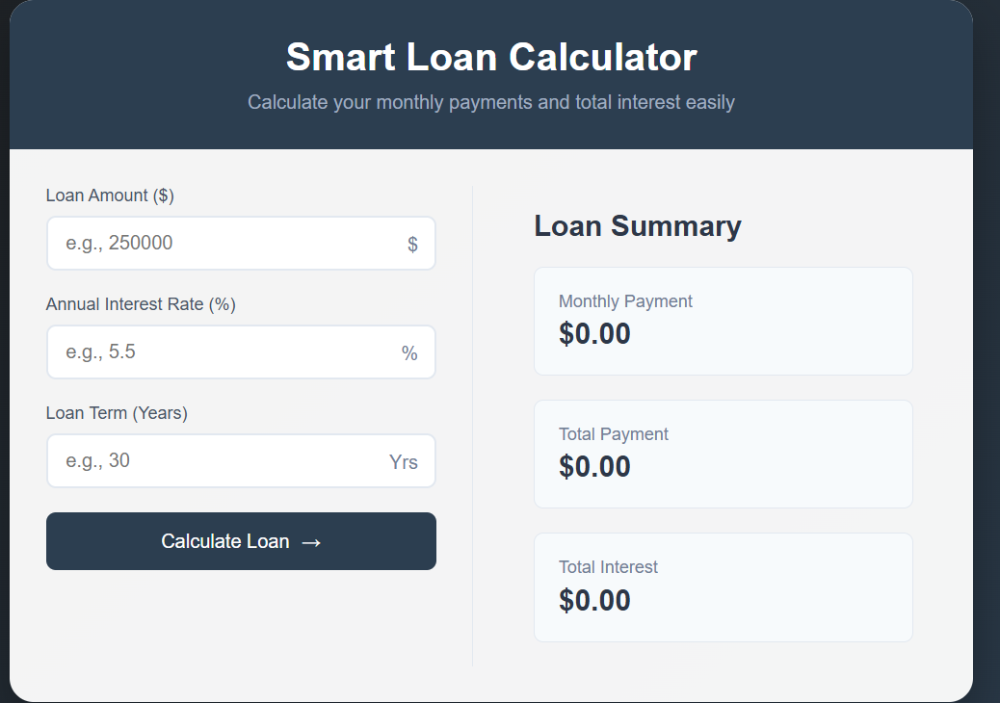

# 💰 Smart Loan Calculator

A simple and interactive web app to help users calculate their monthly loan payments, total payment, and total interest based on the loan amount, interest rate, and term.

---

## 🚀 Features

- Calculate **monthly payment** using standard loan formula
- Display **total payment** and **total interest**
- Clean, responsive UI using HTML, CSS, and JavaScript
- Real-time user interaction with live feedback

---

## 🛠️ Technologies Used

- **HTML5** — For structure
- **CSS3** — For styling and layout
- **Vanilla JavaScript** — For loan calculation logic and DOM interaction

---

## 🧮 How the Loan is Calculated

The formula used is:

M = P × r × (1 + r)^n / ((1 + r)^n – 1)

yaml
Copy
Edit

Where:
- **M** = monthly payment
- **P** = principal loan amount
- **r** = monthly interest rate (annual interest / 12 / 100)
- **n** = loan term in months (years × 12)

---

## 📂 File Structure

📁 smart-loan-calculator/
├── index.html
├── style.css
├── script.js
└── README.md

yaml
Copy
Edit

---

## 🖥️ How to Run

1. Clone or download this repository.
2. Open `index.html` in your browser.
3. Enter loan details and click "Calculate Loan".
4. See the result in the **Loan Summary** panel.

---

## 📷 Preview

> 

---

## 🧑‍💻 Author

**Mrityunjay Kumar**  
📧 [mrityunjay1kumar2@gmail.com](mailto:mrityunjay1kumar2@gmail.com)  
🔗 [LinkedIn](https://www.linkedin.com/in/mrityunjay12)  
🔗 [GitHub](https://github.com/mrityu12)

---

## 📃 License

This project is open-source and available under the [MIT License](LICENSE).
